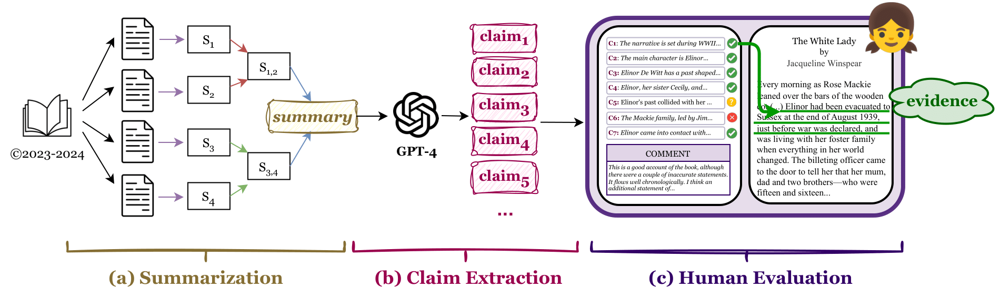

#  : Evaluating faithfulness and content selection in book-length summarization

This repo hosts `FABLES` (Faithfulness Annotations for Book-Length Summarization), a dataset of model-generated summaries with atomic claims annotated for faithfulness. More updates coming soon!

`Authors`: Yekyung Kim, Yapei Chang, Marzena Karpinska, Aparna Garimella, Varun Manjunatha, Kyle Lo, Tanya Goyal, Mohit Iyyer

## Introduction
While long-context large language models (LLMs) can technically summarize book-length documents (> 100K tokens), the length and complexity of the documents have so far prohibited evaluations of input-dependent aspects like faithfulness. In this paper, we conduct the first large-scale human evaluation of faithfulness and content selection on LLM-generated summaries of fictional books. Our study mitigates the issue of data contamination by focusing on summaries of books published in 2023 or 2024, and we hire annotators who have fully read each book prior to the annotation task to minimize cost and cognitive burden. In total, we collect annotations on 3,158 claims made in LLM-generated summaries of 26 books at a cost of $5.2K USD, which allows us to rank LLM summarizers based on faithfulness: CLAUDE-3-OPUS significantly outperforms all closed-source LLMs, while the open-source MIXTRAL is on par with GPT-3.5-TURBO. An analysis of the annotations reveals that most unfaithful claims relate to events and character states, and they generally require indirect reasoning over the narrative to invalidate. While LLM-based auto-raters have proven reliable for factuality and coherence in other settings, we implement several LLM raters of faithfulness and find that none correlates strongly with human annotations, especially with regard to detecting unfaithful claims. Our experiments suggest that detecting unfaithful claims is an important future direction not only for summarization evaluation but also as a testbed for long-context understanding. Finally, we move beyond faithfulness by exploring content selection errors in book-length summarization: we develop a typology of omission errors related to crucial narrative elements and also identify a systematic over-emphasis on events occurring towards the end of the book. We will release our annotations to spur further research on the evaluation of book-length summarization.



## Data

`FABLES` is a dataset created from book-length summaries of narrative books published in 2023-2024. The data contains:

🪄 `Summaries` -- Entire books summarized by one of five models: Mixtral, GPT-3.5-Turbo, GPT-4, GPT-4-Turbo, and Claude-3-Opus, using the hierarchical merging method described in [Chang et al.](https://arxiv.org/pdf/2310.00785.pdf).

🪄 `Claims` -- Decontextualized claims extracted from each summary using GPT-4.

🪄 `Faithfulness Label` -- Assigned by native English-speaking annotators based on their reading. Labels are **"Yes"** (accurate reflection), **"No"** (misrepresentation), **"PartialSupport"** (partially corroborated), or **"Inapplicable"** (indeterminable), applied to each claim.

🪄 `Reason` -- Annotators' justification for each faithfulness label, provided for most claims.

🪄 `Evidence` -- Source text quotations provided by annotators to support their labels, available for most claims.

🪄 `General Comment` -- Overview of issues with the set of claims, including omissions of important information, chronology, salience (mention of unimportant events/details), factuality, and others like repetitiveness or vagueness, with each summary receiving a comment.


```
Coming soon!
```

### Corpus Statistics

|                    | **Books (Documents)** | **Books (Summaries)** | **Books (Claims)** | **Annotations (Reasons)** | **Annotations (Evidence)** | **Annotations (Comments)** |
|--------------------|-----------------------|-----------------------|--------------------|---------------------------|----------------------------|----------------------------|
|                    |       (n=26)          |       (n=130)         |      (n=3,158)     |        (n=1,513)          |          (n=3,051)         |          (n=130)           |
| **Mean**           | 121,467               | 594.3                 | 19.8               | 37.6                      | 194.7                      | 155                        |
| **St. dev.**       | 35,836                | 119.5                 | 6.4                | 33.4                      | 218.5                      | 148.4                      |
| **Max**            | 243,965               | 798                   | 58                 | 281                       | 2,435                      | 823                        |
| **Min**            | 49,762                | 172                   | 6                  | 2                         | 5                          | 6                          |


Number of tokens across books and annotations (`v1`); based on [`tiktoken`](https://github.com/openai/tiktoken) tokenizer.

Please note that the full source texts, being copyrighted, are not included in our release. However, we provide a [list](https://github.com/mungg/FABLES/blob/main/booklist.md) of the books for purchase, facilitating further investigation into summary accuracy and claim verification.


## Disclaimer

The narratives included in this dataset explore a range of themes, some of which may be sensitive, including mental health struggles such as depression, murder, and suicide. Reader discretion is advised.


## Citation Information
If you use this dataset, please cite it as follows:
```
@misc{fables-2024-kim-et-al,
author = {Kim, Yekyung and Chang, Yapei and Karpinska, Marzena and Garimella, Aparna and Manjunatha, Varun and Lo, Kyle and Goyal, Tanya and Iyyer, Mohit},
month = {4},
title = {FABLES: Evaluating faithfulness and content selection in book-length summarization},
url = {},
year = {2024}
}
```
